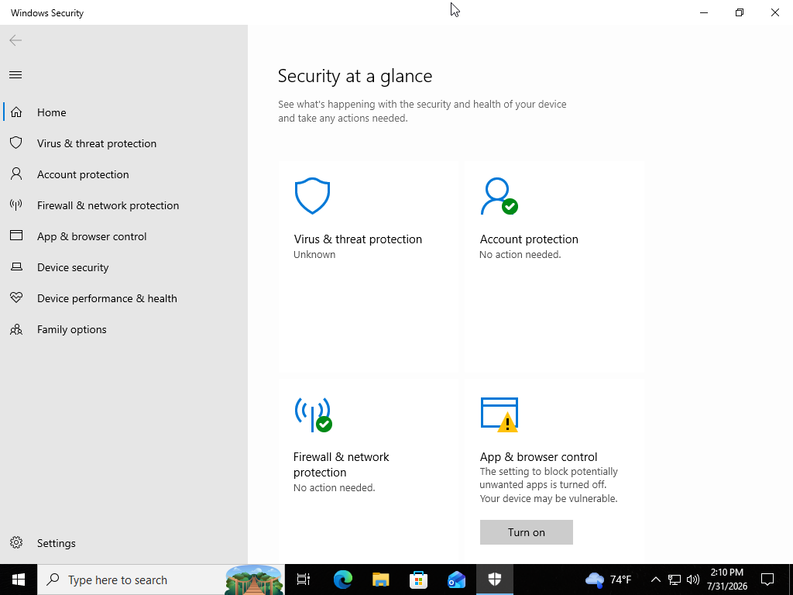
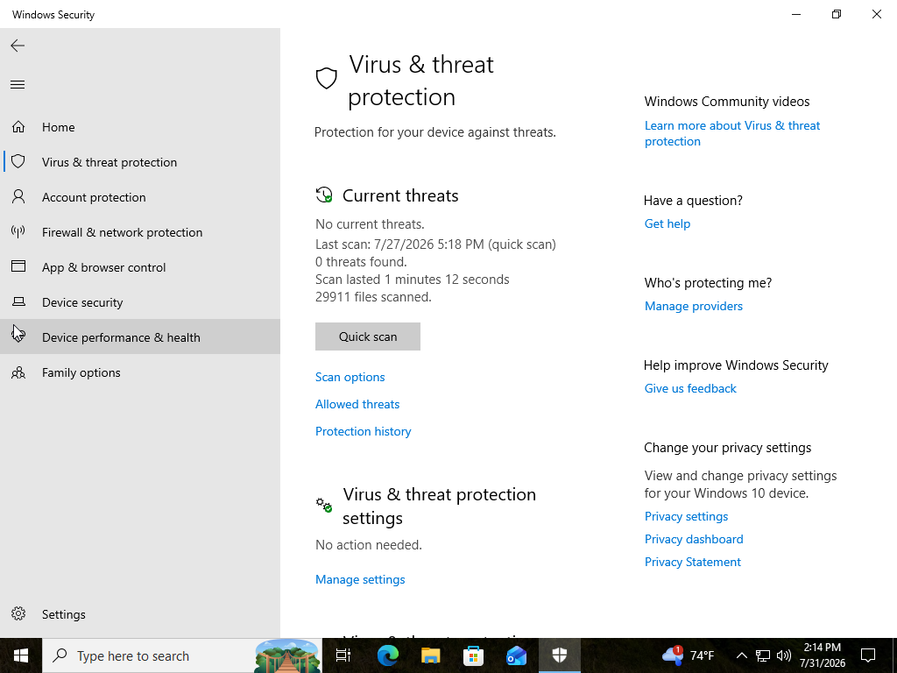
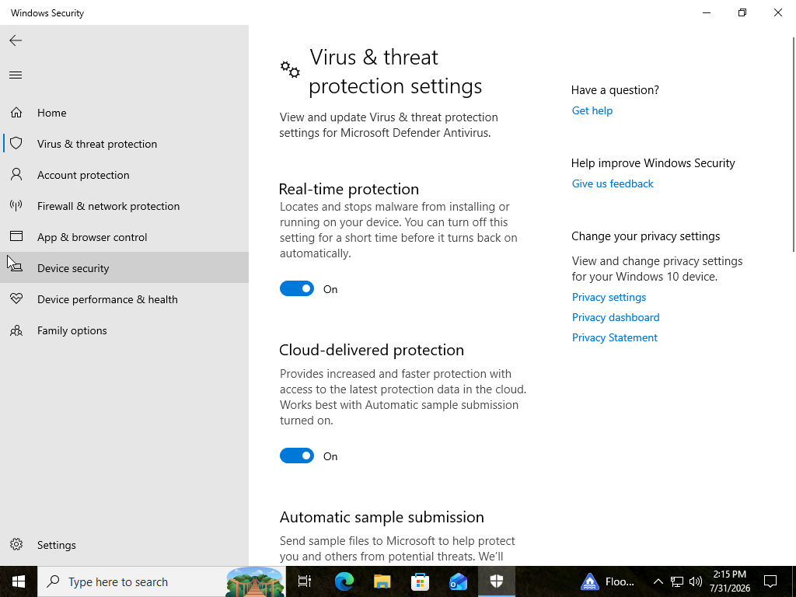
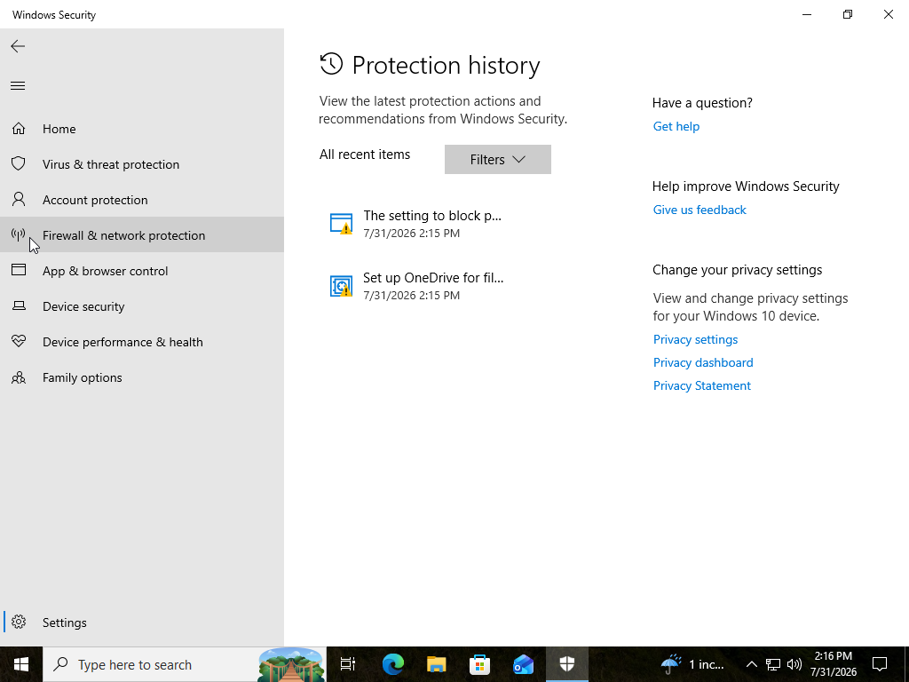
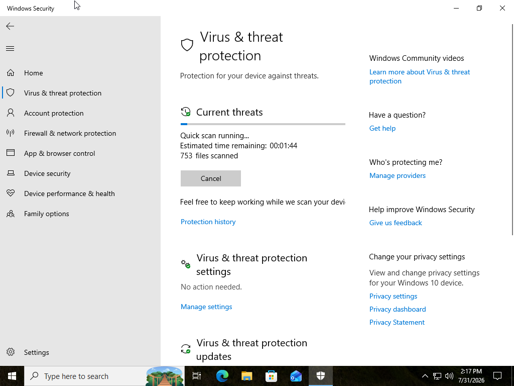
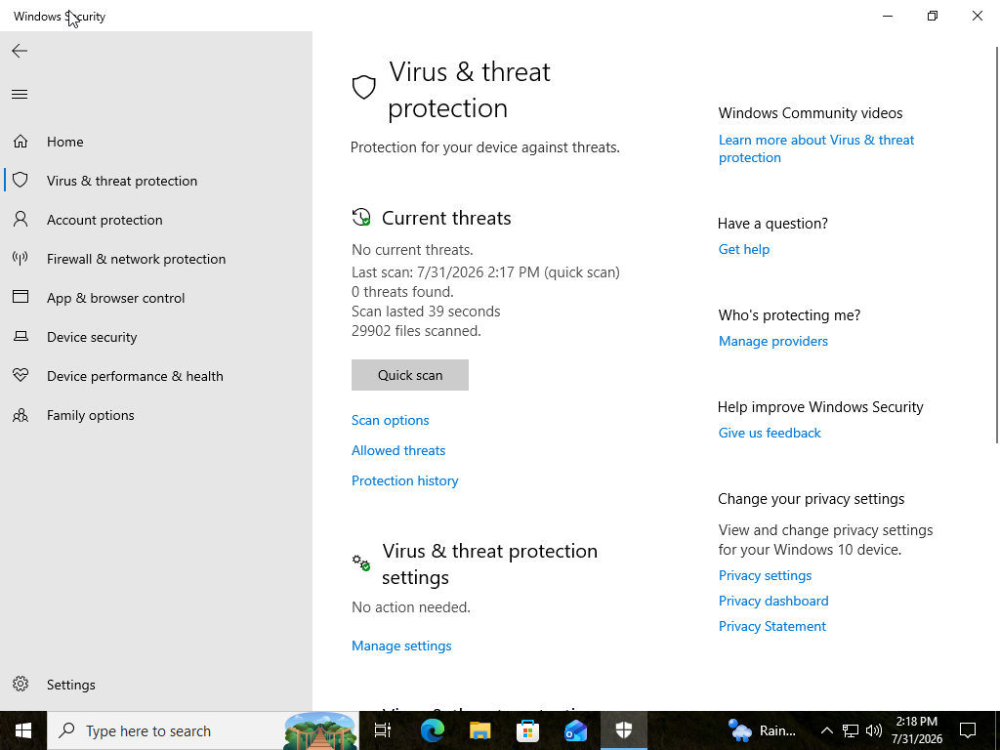
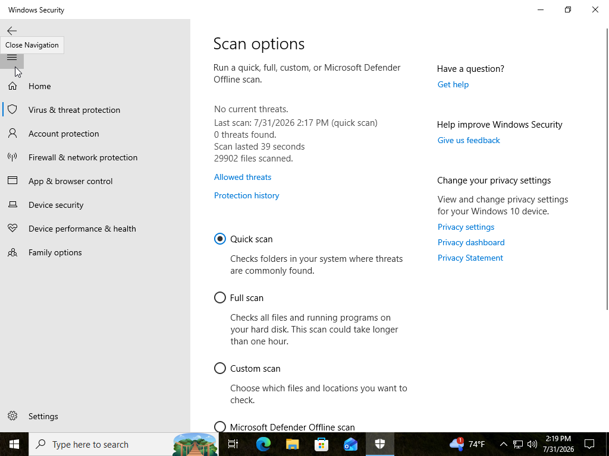
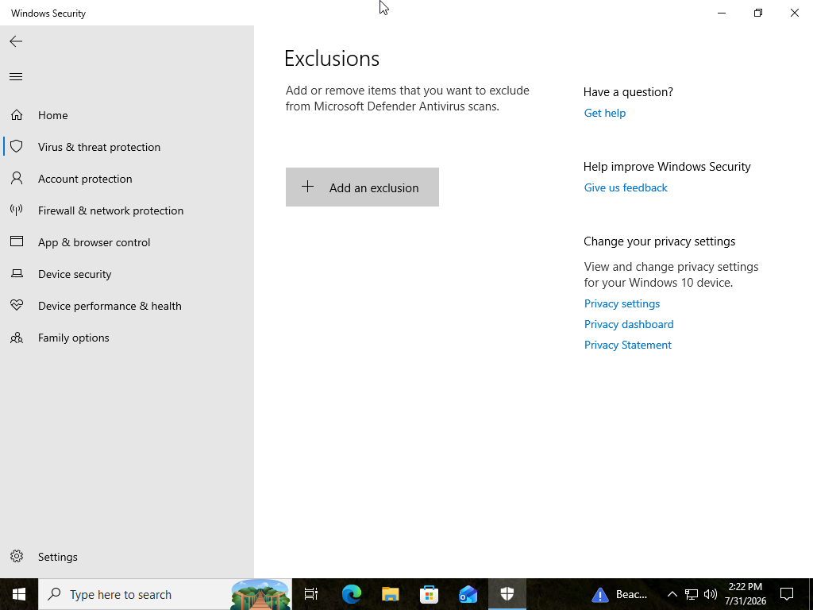
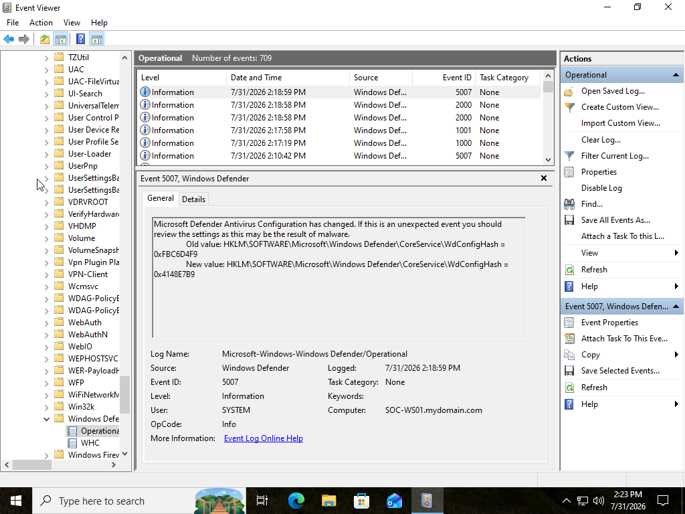
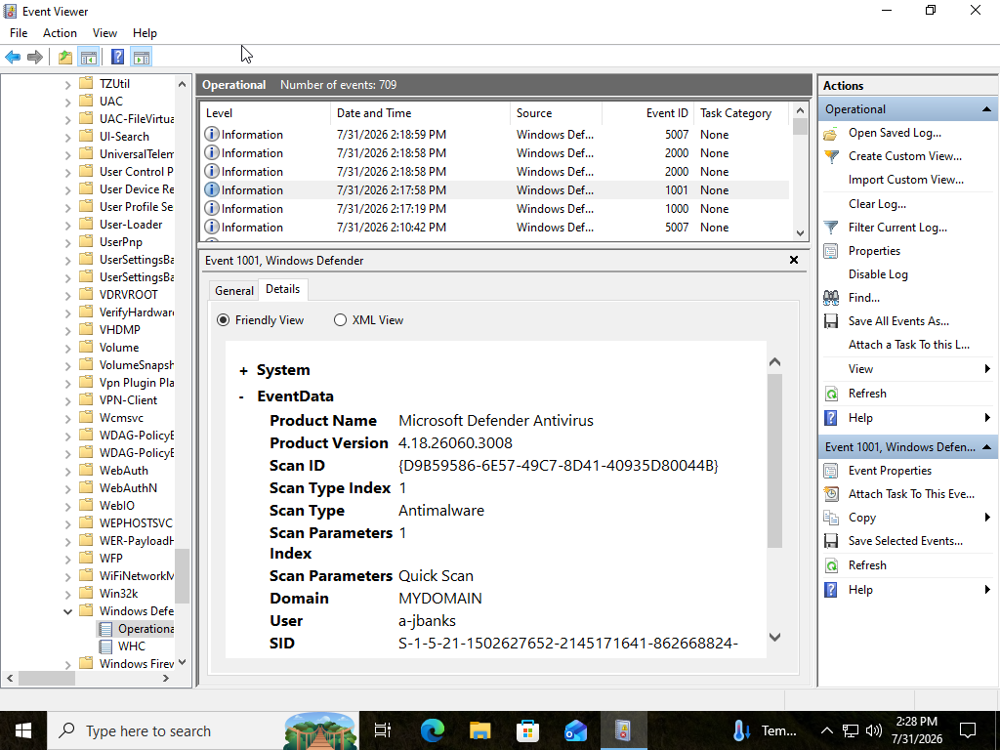

# SOC Analyst Lab #3 - Microsoft Defender Investigation

## Project Overview

This project demonstrates how Microsoft Defender can be used to evaluate the security posture of a Windows endpoint. The lab focused on reviewing Microsoft Defender security settings, performing antivirus scans, examining protection history, and investigating Defender Operational logs using Windows Event Viewer.

By combining Microsoft Defender with Windows Event Viewer, this project simulates the type of endpoint security review that an entry-level SOC analyst may perform when assessing a workstation.

---

# Objectives

- Navigate Microsoft Defender
- Review Windows Security settings
- Verify endpoint protection features
- Perform a Quick Scan
- Review scan results
- Investigate Protection History
- Review Microsoft Defender Operational logs
- Document endpoint security findings

---

# Lab Environment

| Component | Details |
|----------|---------|
| Operating System | Windows 11 |
| Virtualization Platform | Oracle VirtualBox |
| Computer Name | SOC-WS01 |
| Endpoint Protection | Microsoft Defender |
| Log Analysis Tool | Windows Event Viewer |

---

# Tools Used

- Microsoft Defender
- Windows Security
- Event Viewer
- Windows Defender Operational Logs

---

# Investigation Scenario

A Windows workstation has been assigned for a routine endpoint security review.

As the SOC Analyst, the objective is to verify that Microsoft Defender is functioning correctly, review antivirus configuration, perform endpoint scans, examine Defender Operational logs, and document the workstation's security posture.

---

# Investigation Process

## Step 1 – Review Windows Security

Opened Windows Security and reviewed the available protection categories.

These included:

- Virus & Threat Protection
- Account Protection
- Firewall & Network Protection
- App & Browser Control
- Device Security
- Device Performance & Health

---

## Step 2 – Review Virus & Threat Protection

Reviewed:

- Current Threats
- Protection History
- Scan Options
- Protection Updates
- Security Settings

---

## Step 3 – Verify Defender Settings

Reviewed important security features including:

- Real-Time Protection
- Cloud-Delivered Protection
- Automatic Sample Submission
- Tamper Protection

These settings help ensure continuous endpoint protection.

---

## Step 4 – Review Protection History

Reviewed Microsoft Defender Protection History.

No active threats were detected during the investigation.

---

## Step 5 – Perform a Quick Scan

Performed a Microsoft Defender Quick Scan.

The scan completed successfully.

No malware or suspicious files were identified.

---

## Step 6 – Review Scan Options

Reviewed the available scan types:

- Quick Scan
- Full Scan
- Custom Scan
- Microsoft Defender Offline Scan

Each scan type serves a different purpose depending on the investigation.

---

## Step 7 – Review Exclusions

Reviewed Defender Exclusions.

Discussed how exclusions should only be used when absolutely necessary because they reduce endpoint visibility and protection.

---

## Step 8 – Review Defender Operational Logs

Opened:

Applications and Services Logs

↓

Microsoft

↓

Windows

↓

Windows Defender

↓

Operational

Observed events including:

- Scan Started
- Scan Completed
- Antivirus Security Intelligence Updated
- Configuration Changed

---

# Investigation Findings

The investigation determined:

- Microsoft Defender was enabled.
- Real-Time Protection was enabled.
- Tamper Protection was enabled.
- Antivirus Security Intelligence was current.
- Quick Scan completed successfully.
- Defender Operational logs confirmed successful scan activity.
- No malware or suspicious activity was detected.

---

# SOC Analyst Assessment

Based on the evidence collected during this investigation, the workstation appears to be operating in a healthy security state.

Microsoft Defender was functioning normally, endpoint protection features were enabled, security intelligence definitions were current, and antivirus scans completed successfully.

No indicators of compromise or suspicious Defender events were identified during the investigation.

---

# Skills Demonstrated

- Microsoft Defender
- Windows Security
- Endpoint Security
- Antivirus Investigation
- Event Viewer
- Windows Defender Operational Logs
- Endpoint Monitoring
- Security Documentation

---

# Lessons Learned

This lab provided practical experience using Microsoft Defender to evaluate the security posture of a Windows endpoint.

I learned how Microsoft Defender records operational events, how endpoint protection settings influence security, and how Defender complements Windows Event Viewer and Sysmon when investigating endpoint activity.

Understanding how these tools work together is an important skill for SOC analysts responsible for monitoring and investigating Windows endpoints.

---

# Screenshots

## Windows Security Home

---

## Virus & Threat Protection

---

## Defender Protection Settings

---

## Protection History

---

## Quick Scan Running

---

## Quick Scan Results

---

## Scan Options

---

## Defender Exclusions

---

## Defender Operational Log

---

## Investigation Summary

---

# Conclusion

This project demonstrated how Microsoft Defender can be used to assess endpoint security through antivirus scanning, configuration review, protection history, and operational log analysis.

The knowledge gained in this lab strengthens the foundation for future Microsoft Sentinel, Kusto Query Language (KQL), and threat hunting investigations by providing a better understanding of how endpoint security events are generated and investigated.
